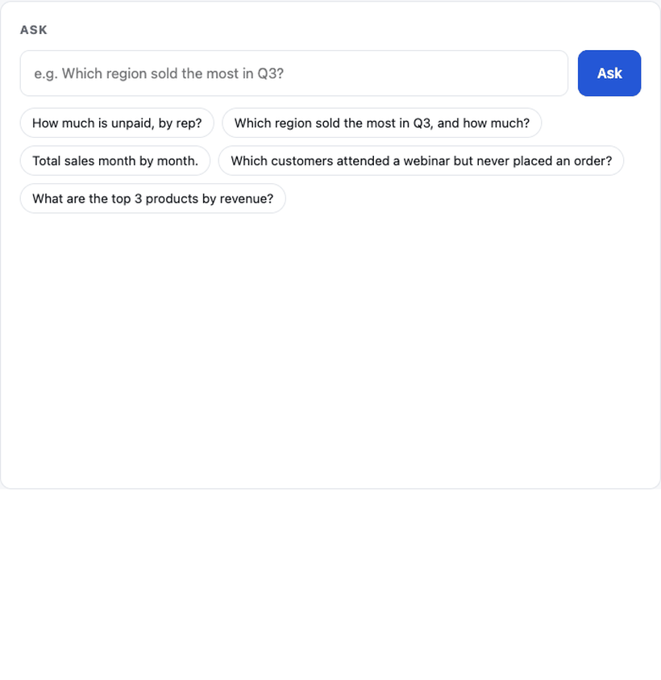
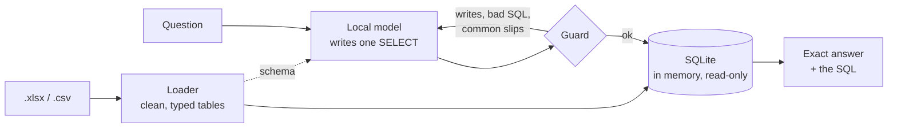

# sheetsense

[](https://github.com/joeljo2347-bit/sheetsense/actions/workflows/tests.yml)


[](https://github.com/astral-sh/ruff)
[](https://mypy-lang.org/)

Ask your spreadsheets questions in plain English and get **exact** answers, on your own computer.


<sub>A real run (the ~9 s wait for the model is shortened). The totals match the spreadsheet to the cent, and the SQL is shown so anyone can check it.</sub>

```console
$ sheetsense ask examples/sales_2025.xlsx examples/webinar_attendance.csv \
    "Which customers attended a webinar but never placed an order?"

SELECT DISTINCT wa.customer AS "Customer"
FROM webinar_attendance wa
LEFT JOIN sales_2025 s ON wa.customer = s.customer
WHERE wa.attended = 'Yes'
  AND s.customer IS NULL;

Customer
─────────────────
Northgate Realty
Marlow Accounting
Oakhaven Vet
```

## Where this comes from

At AMII, a dental implant company, I build and run Noah, the company's AI assistant and ordering
platform. One problem I solved there was getting exact answers and reports from the accounting
team's spreadsheets. This repo rebuilds the core idea from scratch on made-up data; AMII's code
and data stay private.

## Why

Language models understand questions well and do arithmetic badly. Paste a few hundred rows into
a chatbot, ask for a total, and you get a confident number that's a little off, or a list of names
with one missing. For a sales report or a reconciliation, a little off is wrong.

So sheetsense never asks the model for a number. The model reads the question and the column
names and writes one SQL query; SQLite runs it and returns the figures. If the query fails, or
makes a mistake sheetsense knows to look for, it goes back to the model with the reason, up to
three times. The SQL is printed with every answer so you can check it.

Everything runs on your machine with a self-hosted open-weight model: no API keys, nothing uploaded.



## Real spreadsheets are messy

The loader handles what real exports look like, so the query sees clean columns:

| In the sheet | What sheetsense does |
| --- | --- |
| A title and blank rows above the headings | Finds the heading row |
| Money typed as text: `$1,216.50`, `(25.00)` | Reads it as a number (negative in brackets) |
| A **Total** row at the bottom | Leaves it out, so sums aren't doubled |
| `Unpaid`, `unpaid`, `UNPAID` | Matches them all: text compares ignoring case |
| Dates as dates, or as `03/09/2025` | Stores `2025-03-09`, so months group cleanly |
| A status or region column | Shows the model its few values, so it spells them right |
| Two columns with the same heading | Gives them distinct names |

The guard catches the model's most common slips before they become wrong answers. For example, a
model will often write `SUBSTR(amount, 2)` to strip a `$` that's already gone, which silently
drops the first digit of every amount. sheetsense refuses that query and tells the model why.

## Install

```bash
pip install git+https://github.com/joeljo2347-bit/sheetsense
# plus a local model server with a model that writes SQL well (see model.py)
```

Python 3.9+ and one dependency (`openpyxl`).

## Use

```bash
sheetsense describe sales.xlsx                          # the tables and columns a question can use
sheetsense ask sales.xlsx "How much is unpaid, by rep?" # a question in plain English
sheetsense ask sales.xlsx leads.csv "Which leads never bought?"   # across files
sheetsense sql sales.xlsx "SELECT region, SUM(amount) FROM sales GROUP BY region"
```

`--model` picks another model (or set `SHEETSENSE_MODEL`); `--quiet` prints only the answer.

## Web demo

The same thing in a browser: pick the example files or upload your own, ask, and see the answer
with the query behind it.

```bash
pip install -e ".[web]"
uvicorn sheetsense.web:app --port 8000      # then open http://localhost:8000
```

Or in Docker, with the model server running on the host:

```bash
docker build -t sheetsense .
docker run -p 8000:8000 sheetsense                       # Docker Desktop (Mac, Windows)
docker run -p 8000:8000 --add-host=host.docker.internal:host-gateway sheetsense   # Linux
```

On Linux, make the model server listen on all addresses so the container can reach it.

Inside the container every request comes from Docker's bridge gateway, so on its own every visitor shares
one question limit. To put it online, run it behind a reverse proxy on the host that sets `X-Forwarded-For`,
publish the port to the host only, and name the proxy's address as the container sees it:

```bash
docker run -p 127.0.0.1:8000:8000 --add-host=host.docker.internal:host-gateway \
  -e SHEETSENSE_TRUSTED_PROXIES=172.17.0.1 sheetsense
```

`SHEETSENSE_TRUSTED_PROXIES` takes a comma-separated list of addresses or networks (e.g. `172.17.0.0/16`).
It is empty by default, and then `X-Forwarded-For` is ignored: anyone can send that header, so believing it
from any other address would let visitors pick their own identity and get round the limit.

It's built to be put online: uploads are size-checked, used only for the question and deleted right after; one
question runs on the model at a time; each visitor gets 15 questions per 10 minutes. `deploy/setup.sh`
sets it up on an Ubuntu server with a model server, a systemd service and HTTPS through Caddy.

## Accuracy

`scripts/accuracy.py` asks eight questions about the example files and compares each answer with a
hand-written query: totals, filters, month-by-month, top-N, a join across files, an average.

| Model | Correct | Time per question |
| --- | --- | --- |
| Model A (20B, open-weight) | 24/24 | 2.9 s |
| Model B (8B, open-weight) | 22/24 | 17.4 s |

Three runs of each question, on an Apple M5 Pro. Eight questions on two files is a small test;
it shows the approach works, not that it never fails. The SQL is always printed so you can check it.

## Develop

```bash
git clone https://github.com/joeljo2347-bit/sheetsense && cd sheetsense
pip install -U pip                   # macOS's built-in pip is too old for -e installs
pip install -e ".[dev]"
pytest                               # no model needed: tests use a stand-in
python3 scripts/make_examples.py     # rebuild the example files
python3 scripts/accuracy.py          # needs the model server
```

```
src/sheetsense/
  tables.py   spreadsheets → clean SQLite tables, and the schema the model sees
  guard.py    what may run (one SELECT, read-only, time-limited) and slips worth catching
  ask.py      question → SQL → answer, sending failures back to the model
  model.py    the model client and the instructions
  cli.py      describe / ask / sql
```

## Limits

- One query per question. Questions that need several steps ("compare this month to the average
  of the last three, then explain") work only when they fit in one SELECT.
- The example data is made up. Your sheets will have surprises; `describe` shows how they loaded.
- Up to 500 result rows are returned per question.
- Numbers written the European way (`1 200,50`) are read as text.
- Old `.xls` files aren't supported; save them as `.xlsx` first.

## License

MIT
